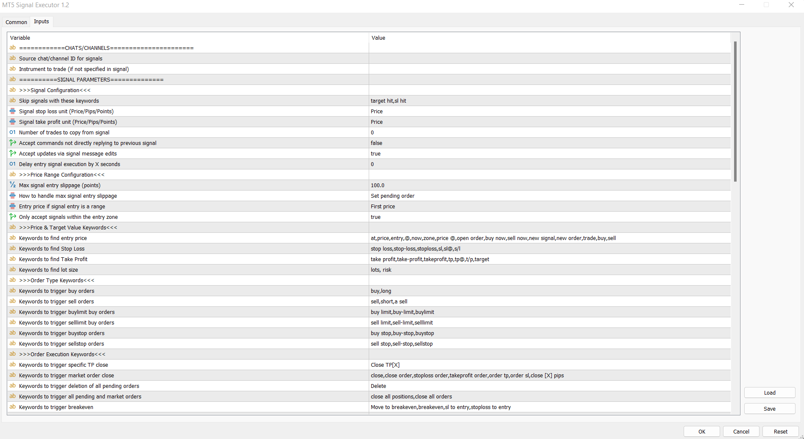
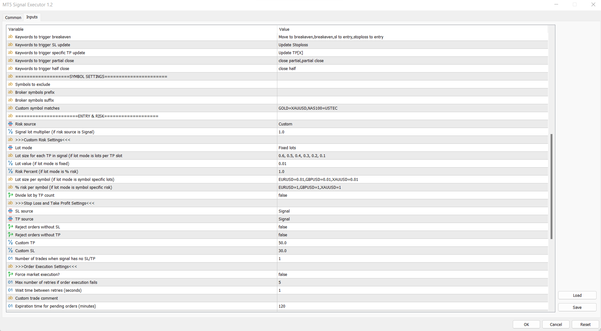
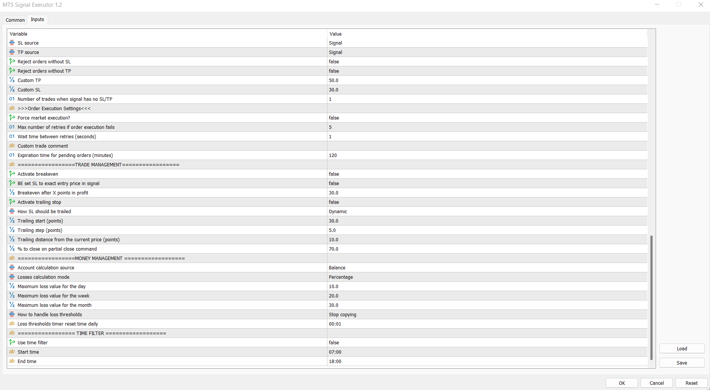

# Telegram Channel/Group Copier + MT4/MT5 Expert Advisors

A complete Telegram-to-MT4/MT5 signal copying solution.

This repository includes:

- A **desktop application** that monitors selected Telegram channels or groups and copies trading signals based on keyword detection.
- **Demo Expert Advisors (EAs)** for **MT4** and **MT5** that automatically read and execute those copied signals in your trading terminal.

The desktop app uses **PyQt5** for the GUI and **Telethon** for Telegram API integration. The signals are saved to your MT4/MT5 `Common` folder, where the EAs pick them up and place/modify/delete trades accordingly.

---

## Features

### Telegram Copier (Desktop App)

- **Telegram Integration** using Telethon.
- **GUI for Channel Selection** (PyQt5).
- **Automatic Signal Parsing** via customizable keywords.
- **Live Monitoring** of selected Telegram channels/groups.
- **Signal Logging** for audit and debugging.
- **Daily log files** are stored in the `LOGS/` directory.

### MT4 & MT5 Expert Advisors

- **Signal Reader**: Reads signals from the common folder.
- **Trade Executor**: Places and manages trades based on parsed signal content.
- **Auto Handling**: Supports new trades, updates, and deletions.
- **Robust Error Handling**: Prevents duplicate or malformed trade actions.
- **Log Outputs**: Visual log in the Experts tab + file logs for diagnostics.

---

## Requirements

- Python 3.11+
- MetaTrader 4 or MetaTrader 5 (with AutoTrading enabled)
- Telegram account
- Dependencies in `requirements.txt`

---

## Installation & Setup

### 1. Clone the Repository

```sh
git clone https://github.com/oluklef17/telegram-mt4-mt5-copier.git
cd telegram-mt4-mt5-copier
````

### 2. Install Python Dependencies

```sh
pip install -r requirements.txt
```

### 3. Configure Telegram API Credentials

* Get `api_id` and `api_hash` from [my.telegram.org](https://my.telegram.org).
* Set them inside `copier.py`.

---

## How to Use

### Telegram Copier Desktop App

```sh
python copier.py
```

1. **Login to Telegram**

   * Phone number with country code.
   * Code from Telegram.
   * (If enabled) 2FA password.

2. **Select Channels**

   * Select the channels/groups you want to monitor.
   * Saved in `selected_channels.txt`.

3. **Start Monitoring**

   * Signals will be copied and saved into the `MQL4/Files` or `MQL5/Files` directory (via the MT common path).
   * Logs are stored in the `LOGS/` directory.

---

### MT4/MT5 Expert Advisors

1. **Copy EAs**

   * `MT4 Signal Executor.ex4` → `MQL4/Experts/`
   * `MT5 Signal Executor.ex5` → `MQL5/Experts/`

2. **Attach to Any Chart**

   * Launch MT4 or MT5.
   * Drag **EchoTrade Signal Executor** onto any chart.
   * Make sure **AutoTrading** is enabled.

3. **Watch It Trade**

   * EA will automatically process new signals written by the desktop app.
   * View logs in the **Experts** or **Journal** tabs.

> ⚠️ The EAs and the desktop app must be running on the **same machine** (or have shared access to the `Common` directory).

---

## File Structure

```
.
├── copier.py                     # Telegram Copier main app
├── file_handler.py               # File writing logic for MT4/MT5
├── parser.py                     # Keyword-based signal parser
├── image_reader.py               # OCR from images/videos
├── selected_channels.txt         # Your selected Telegram channels
├── requirements.txt              # Python dependencies
├── LOGS/                         # Daily app logs
├── EAs/
│   ├── MT4 Signal Executor.ex4  # MT4 EA
│   └── MT5 Signal Executor.ex5.ex5  # MT5 EA
└── ETC.ico / ETC.png             # App icon and background image
```

---

## Customization

* **Keyword Rules** → Edit `parser.py` to suit your signal format.
* **EA Parameters** → Input settings inside MT4/MT5 (e.g., lot size, magic number, slippage).
* **Icons and Branding** → Replace `ETC.ico` / `ETC.png`.

---

## Troubleshooting

* **App not writing files**: Ensure it has permission to write to the MT common path.
* **EA not executing trades**:

  * Confirm files are appearing in `Common/Files`.
  * Check Experts/Journal logs for errors.
  * Confirm AutoTrading is enabled.
* **Signal not detected**: Update keywords in `parser.py`.

---

## Official Product Links

This repository is based on our full-featured commercial product — **EchoTrade Telegram Copier**.
For access to the complete package with installer, auto-updates, and production-ready MT4/MT5 EAs:

* 💻 **Get the Desktop Application**
  [Download EchoTrade Copier App (Windows)](https://www.mql5.com/go?link=https://drive.google.com/file/d/1hu61hKpWJO7Tt0XtmU1AQbRzFcQMhORb/view?usp=sharing)

* 🛒 **Purchase the MT4 Expert Advisor**
  [EchoTrade MT4 EA on MQL5](https://www.mql5.com/en/market/product/136831)

* 🛒 **Purchase the MT5 Expert Advisor**
  [EchoTrade MT5 EA on MQL5](https://www.mql5.com/en/market/product/136765)

> ✅ For complete automation, use the desktop app in combination with the MT4 or MT5 EA — just like EchoTrade’s copier system.

---

## License

This project is provided for educational and personal use only. Do not use for spamming, unauthorized automation, or any violation of Telegram or broker terms.

---

## Credits

* [Telethon](https://github.com/LonamiWebs/Telethon)
* [PyQt5](https://riverbankcomputing.com/software/pyqt/intro)
* MT4/MT5 EA logic powered by our **EchoTrade Telegram Copier** system.

## Application Preview


## EA Configuration






